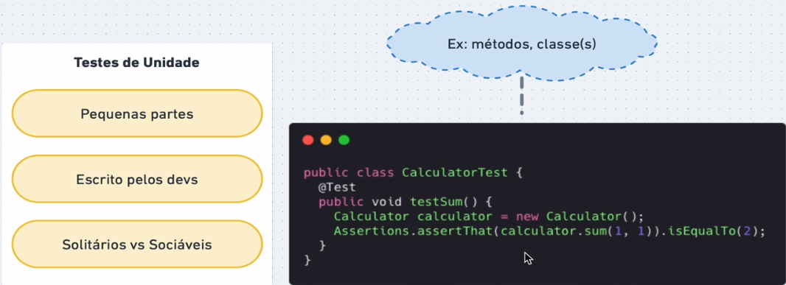
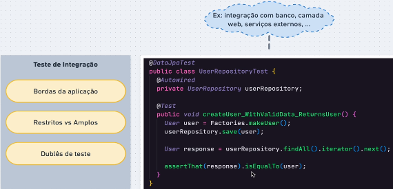
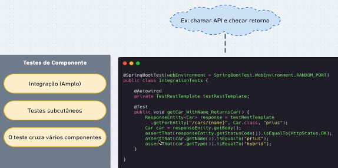
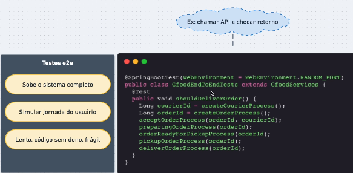
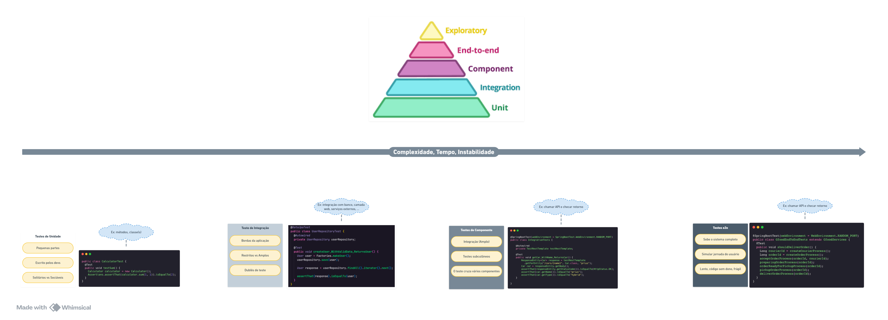

<h1 align="center">
  StarWars Planet API (sw-planet-api)
</h1>

<p align="center">
  <a href="#-technologies">Tecnologias</a>&nbsp;&nbsp;&nbsp;|&nbsp;&nbsp;&nbsp;
  <a href="#-introdução">Introdução</a>&nbsp;&nbsp;&nbsp;&nbsp;&nbsp;&nbsp;
</p>

<p align="center">
  
</p>

## ✨ Technologies

- [Mysql](https://dev.mysql.com/downloads/mysql/)
- [Java](https://www.oracle.com/java/technologies/downloads/)
- [Maven](https://maven.apache.org/download.cgi)
- [Spring Boot](https://spring.io/projects/spring-boot)
- [Spring Testing](https://docs.spring.io/spring-framework/docs/current/reference/html/testing.html#testing-introduction)
- [JUnit 5](https://junit.org/junit5/docs/current/user-guide/)
- [Mockito](https://site.mockito.org)
- [AssertJ](https://github.com/assertj/assertj)
- [Hamcrest](http://hamcrest.org/JavaHamcrest/)
- [Jacoco](https://github.com/jacoco/jacoco)
- [Pitest](https://pitest.org)

# 📌 Tópicos

* [✨ Technologies](#-technologies)
* [💻 Introdução - Projeto](#-introdução---projeto)
<hr>

* [Escrevendo o Primeiro Teste Automatizado 🛠️](#-escrevendo-o-primeiro-teste-automatizado)
* [JUnit](#junit)
* [AssertJ](#assertj)
<hr>

* [🧪 Tipos de Teste](#-tipos-de-teste)
  * [Teste de Unidade](#teste-de-unidade)
  * [Teste de Integração](#teste-de-integração)
  * [Teste de Componente ou Subcutâneo](#teste-de-componente-ou-subcutâneo)
  * [Teste de e2e](#teste-de-e2e)
<hr>

* [Estudo Final do Projeto](#estudo-final-do-projeto)


# 💻 Introdução - Projeto

sw-planet-api é um serviço web que provê dados sobre a franquia de Star Wars, mais especificamente sobre os planetas 
que aparecem nos filmes.

Esse projeto foi elaborado durante o curso [Testes automatizados na prática com Spring Boot](https://www.udemy.com/course/testes-automatizados-na-pratica-com-spring-boot/?referralCode=7F6C5AA14AE558497FE0), em que o foco foi a criação de testes automatizados.


>❗ lembrar de configurar o mysql no mysqlcommandline


## 🛠️ Escrevendo o Primeiro Teste Automatizado

Normalmente usamos SOUT para testar alguma coisa.

Mas a ideia não é mexer no código pra imprimir valores. Isso acaba sendo
muito manual. Não é eficiente.

Criaremos Classes dentro do package tests para isso.

Dentro da classe, criaremos um método void. Nesse caso, testaremos a soma (método criado dentro da Calculator).

E como falar pra IDE testar esse código? Bom, aí entra o JUnit.

## JUnit

Uma biblioteca destinada a testes. Basta passarmos no método @Test.

```java
import org.junit.jupiter.api.Test;

public class CalculatorTest {
    @Test
    public void testSum() {
        Calculator calculator = new Calculator();
        System.out.println(calculator.soma(1, 2));
    }
}
```

O problema desse método é que só estamos imprimindo o resultado. Pro teste ser automatizado (aferido), usaremos
a bilioteca AsserJ.

## AssertJ

Ela nos permite escrever os Assert de forma mais fluída, com fácil leitura. Para usarmos o AsserJ, usaremos a classe
**Assertions**, veja:

```java
import static org.assertj.core.api.Assertions.assertThat ;
import org.junit.jupiter.api.Test;
public class CalculatorTest {
    @Test
    public void testSum() {
        Calculator calculator = new Calculator();

        assertThat(calculator.soma(1,1)).isEqualTo(2);
    }
}
```

**Resumo: JUnit para executar os testes e AssertJ para aferir os resultados.**

## 🧪 Tipos de Teste

### [Teste de Unidade](https://github.com/zenonxd/estudo-testes-unidade)
Pequena parte do codigo/sistema. Unidade seria métodos ou classes.



Testes de Unidade podem ser:

Solitários - Não interage com outras unidades. A calculadora, por exemplo, seu método soma não depende de nada.
De nenhum banco de dado ou método externo.

Sociável - Quando uma unidade conversa com outro método de código. Quando há alguma dependência no teste.
<hr>

### [Teste de Integração](https://github.com/zenonxd/estudo-testes-integracao)
Testar bordas da aplicação, quando excedemos a sua fronteira. Isso vai ocorrer quando há alguma integração com banco
de dado, camada web...



Existem dois tipos de teste te ingração e eles dependem do escopo onde trabalham:

Restrito - Quando o teste trabalha somente com uma integração, uma camada (repositorio e dado por exemplo).

Amplos - Testes que cruzam outras camadas (teste de componente, por exemplo).

E para que seja possível conversar com essas camadas? Usamos **dublês de teste**. Se a aplicação usar um banco Oracle,
por exemplo, não é necessário levantar um banco desse toda vez para testar a aplicação. Além de ser pesado, seria muito
caro.

A ideia então, é criar um duble de teste! Duplar esse banco, um quebra galho. **Tipo um banco H2**.
<hr>

### [Teste de Componente ou Subcutâneo](https://github.com/zenonxd/estudo-testes-subcutaneos)
Seria um teste subcutâneo. Ele cruza várias camadas e componentes do sistema. 


<hr>

### [Teste de e2e](https://github.com/zenonxd/estudo-testes-subcutaneos)
Aqui a ideia é subir o sistema por completo mesmo, com servidor de aplicação, banco de dados, webservice...



Por subir todo o sistema, acaba sendo um pouco lento e por consequência, ineficiente. Quebra fácil por depender
de muita coisa.
<hr>

#### Bom, se a cada teste que fazemos, ele fica mais lento, maior e com mais "desvantagens", porque não só fazer o primeiro?

Bom, tem a questão da confiabilidade do teste. O primeiro teste é estável porque ele simula muita coisa, não
tem muita coisa a ver com o mundo real. O último teste, por exemplo, TEM TUDO, simula de fato um ambiente de 
produção. Portanto, é muito mais fácil encontrar um erro no último teste do que no primeiro.
<hr>

#### Quanto de cada teste devemos fazer dentro do sistema?



A base é mais larga que o topo. Portanto, na base devemos escrever muito mais testes de unidade e integração.
Serão mais rápidos e menos complexos.

Já os de cima (topo) e mais manual, ele é mais lento e caro de ser feito. Então minimizamos o número de testes
desse tipo.

Então não descartamos NADA, somente otimizamos o que deve ser feito.

## [Estudo Final do Projeto](https://github.com/zenonxd/estudo-final-testes)
